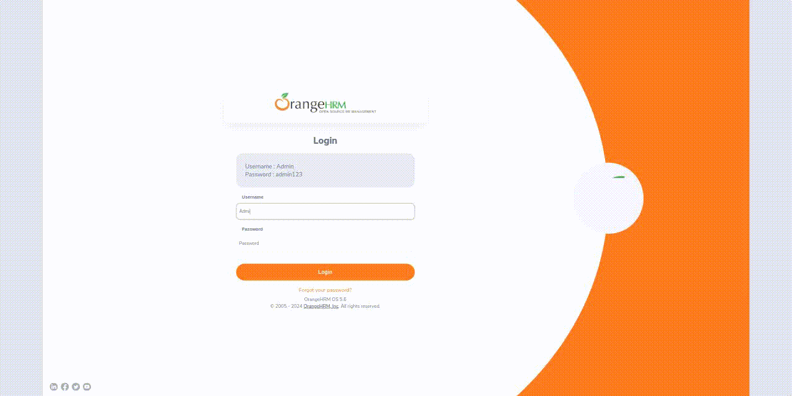

#  Cypress - HR system E2E tests 

<p align="center">

</p>

## Installation

Clone the repository

```
git clone https://github.com/acelmer/cypress-hr-system.git
```

Install project dependencies

```
npm install
```

Open Cypress Launchpad

```
npx cypress open
```

## Environment Variables

Create a **cypress.env.json** file and add your own variable values

```
{
    "HR_SYSTEM_USERNAME": "your username",
    "HR_SYSTEM_PASSWORD":  "your password",
}
```
